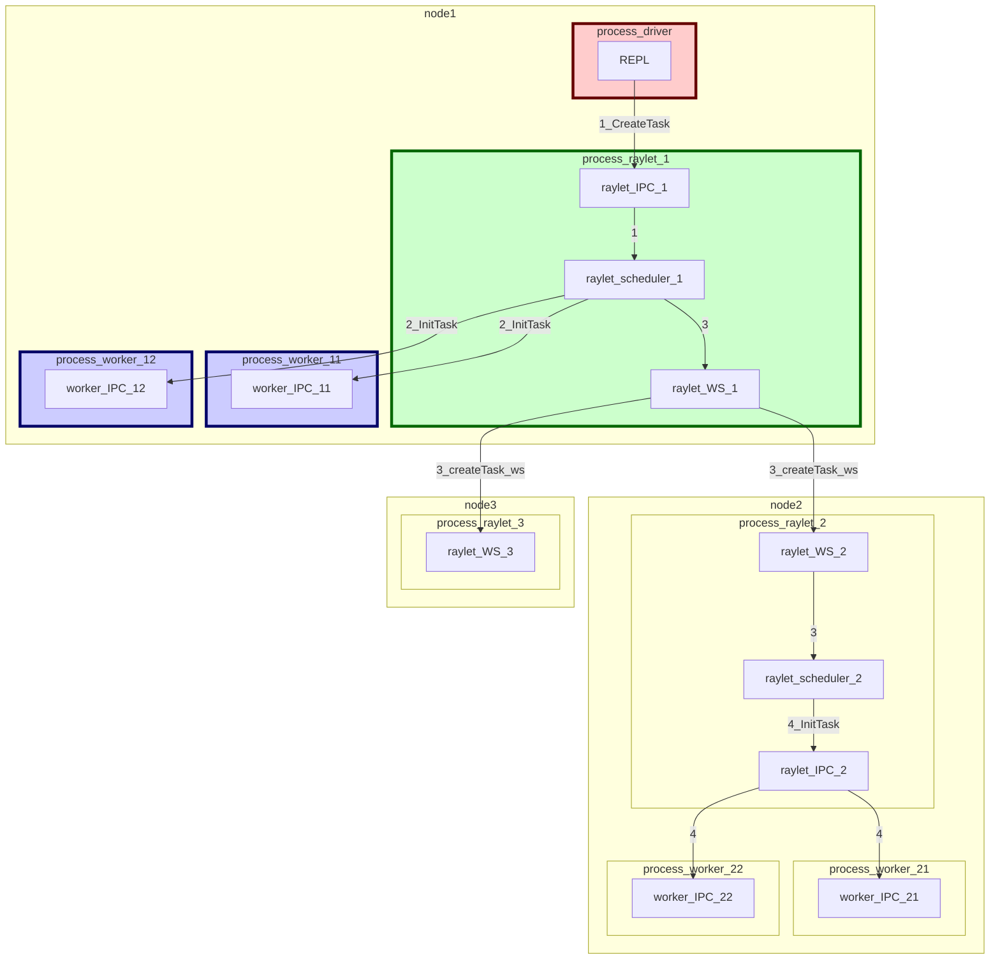

```mermaid
graph TD
    subgraph node1
        subgraph process_driver
            REPL
        end
        subgraph process_raylet_1
            raylet_IPC_1
            raylet_scheduler_1
            raylet_WS_1
        end
        subgraph process_worker_11
            worker_IPC_11
        end
        subgraph process_worker_12
            worker_IPC_12
        end
        REPL -- 1_CreateTask --> raylet_IPC_1
        raylet_IPC_1 -- 1 --> raylet_scheduler_1
        raylet_scheduler_1 -- 3 --> raylet_WS_1
        raylet_scheduler_1 -- 2_InitTask --> worker_IPC_11
        raylet_scheduler_1 -- 2_InitTask --> worker_IPC_12
    end
    subgraph node2
        subgraph process_raylet_2
            raylet_IPC_2
            raylet_scheduler_2
            raylet_WS_2
        end
        subgraph process_worker_21
            worker_IPC_21
        end
        subgraph process_worker_22
            worker_IPC_22
        end
        raylet_WS_2 -- 3 --> raylet_scheduler_2
        raylet_scheduler_2 -- 4_InitTask --> raylet_IPC_2
        raylet_IPC_2 -- 4 --> worker_IPC_21
        raylet_IPC_2 -- 4 --> worker_IPC_22
    end
    subgraph node3
        subgraph process_raylet_3
            raylet_WS_3
        end
    end
    raylet_WS_1 -- 3_createTask_ws --> raylet_WS_2
    raylet_WS_1 -- 3_createTask_ws --> raylet_WS_3

    style process_driver fill:#FFCCCC,stroke:#660000,stroke-width:4px
    style process_raylet_1 fill:#CCFFCC,stroke:#006600,stroke-width:4px
    style process_worker_11 fill:#CCCCFF,stroke:#000066,stroke-width:4px
    style process_worker_12 fill:#CCCCFF,stroke:#000066,stroke-width:4px
```