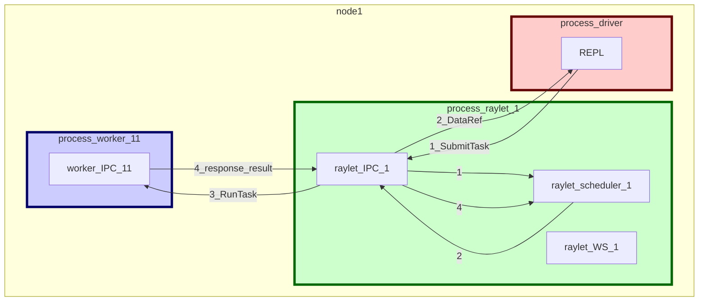

# REPL -> Local-main worker

```mermaid
graph TD
    subgraph node1
        subgraph process_driver
            REPL
        end
        subgraph process_raylet_1
            raylet_IPC_1
            raylet_scheduler_1
            raylet_WS_1
        end
        subgraph process_worker_11
            worker_IPC_11
        end
        REPL -- 1_SubmitTask --> raylet_IPC_1
        raylet_IPC_1 -- 2_DataRef --> REPL
        raylet_IPC_1 -- 1 --> raylet_scheduler_1
        raylet_scheduler_1 -- 2 --> raylet_IPC_1
        raylet_IPC_1 -- 3_RunTask --> worker_IPC_11
        worker_IPC_11 -- 4_response_result --> raylet_IPC_1
        raylet_IPC_1 -- 4 --> raylet_scheduler_1
    end

    style process_driver fill:#FFCCCC,stroke:#660000,stroke-width:4px
    style process_raylet_1 fill:#CCFFCC,stroke:#006600,stroke-width:4px
    style process_worker_11 fill:#CCCCFF,stroke:#000066,stroke-width:4px
```