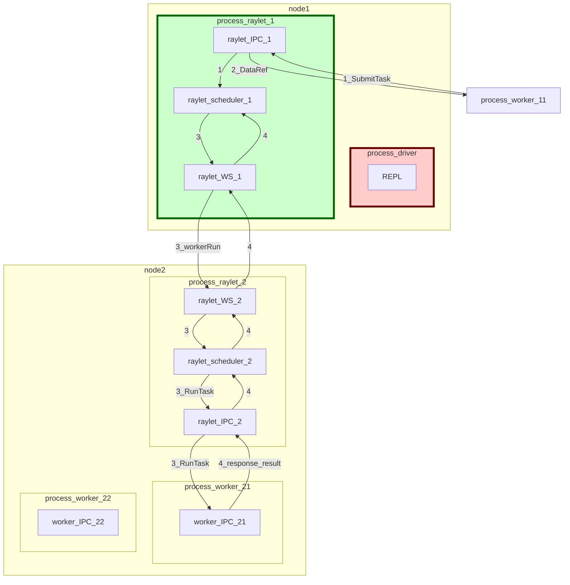

# Remote worker -> Remote worker

```mermaid
graph TD
    subgraph node1
        subgraph process_driver
            REPL
        end
        subgraph process_raylet_1
            raylet_IPC_1
            raylet_scheduler_1
            raylet_WS_1
        end
    end
    subgraph node2
        subgraph process_raylet_2
            raylet_IPC_2
            raylet_scheduler_2
            raylet_WS_2
        end
        subgraph process_worker_21
            worker_IPC_21
        end
        subgraph process_worker_22
            worker_IPC_22
        end
    end
    process_worker_11 -- 1_SubmitTask --> raylet_IPC_1
    raylet_IPC_1 -- 2_DataRef --> process_worker_11
    raylet_IPC_1 -- 1 --> raylet_scheduler_1
    raylet_scheduler_1 -- 3 --> raylet_WS_1
    raylet_WS_1 -- 3_workerRun --> raylet_WS_2
    raylet_WS_2 -- 3 --> raylet_scheduler_2
    raylet_scheduler_2 -- 3_RunTask --> raylet_IPC_2
    raylet_IPC_2 -- 3_RunTask --> worker_IPC_21
    worker_IPC_21 -- 4_response_result --> raylet_IPC_2
    raylet_IPC_2 -- 4 --> raylet_scheduler_2
    raylet_scheduler_2 -- 4 --> raylet_WS_2
    raylet_WS_2 -- 4 --> raylet_WS_1
    raylet_WS_1 -- 4 --> raylet_scheduler_1

    style process_driver fill:#FFCCCC,stroke:#660000,stroke-width:4px
    style process_raylet_1 fill:#CCFFCC,stroke:#006600,stroke-width:4px
```