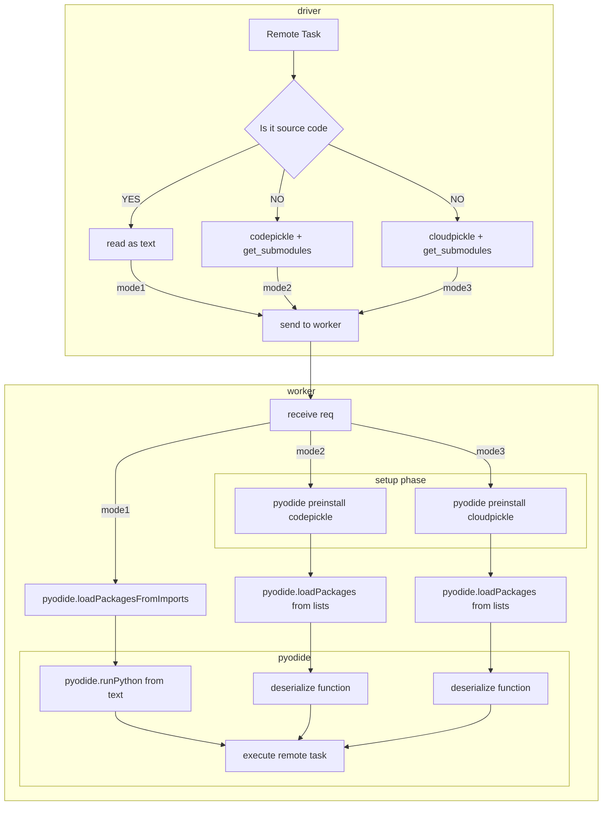

```mermaid
graph TD
    subgraph driver
        d1[Remote Task] --> d2{Is it source code}
        d2 --> |YES| ds1[read as text] --> |mode1| dw[send to worker]
        d2 --> |NO| dsc1[codepickle + get_submodules] --> |mode2| dw
        d2 --> |NO| db1[cloudpickle + get_submodules] --> |mode3| dw
    end
    subgraph worker
        dw --> dw2[receive req]
        dw2 --> |mode1| ds2[pyodide.loadPackagesFromImports] --> ds3
        subgraph setup phase
            dsc2
            db2
        end
        dw2 --> |mode2| dsc2[pyodide preinstall codepickle] --> dsc3[pyodide.loadPackages from lists] --> dsc4
        dw2 --> |mode3| db2[pyodide preinstall cloudpickle] --> db3[pyodide.loadPackages from lists] --> db4
        subgraph pyodide
            ds3[pyodide.runPython from text] --> w1[execute remote task]
            dsc4[deserialize function] --> w1
            db4[deserialize function] --> w1
        end
    end
```